# 📚 Class 2: Search, Filter, Sorting & Static Files
## Django Full Stack Course - Online Session (1.5 Hours)

---

# 📊 MERMAID DIAGRAMS

## 1️⃣ Search & Filter Flow

```mermaid
flowchart TD
    subgraph USER["🧑‍💻 USER INPUT"]
        A[Type in Search Box] --> B["search=john"]
        C[Select Class Dropdown] --> D["class=8"]
        E[Click Column Header] --> F["sort=name"]
    end
    
    subgraph URL["🔗 URL PARAMETERS"]
        B --> G["?search=john&class=8&sort=name"]
        D --> G
        F --> G
    end
    
    subgraph VIEW["⚙️ VIEWS.PY"]
        G --> H["request.GET.get('search')"]
        G --> I["request.GET.get('class')"]
        G --> J["request.GET.get('sort')"]
    end
    
    subgraph QUERY["🗃️ QUERYSET BUILDING"]
        H --> K["students.filter(Q(...))"]
        I --> L[".filter(student_class=...)"]
        J --> M[".order_by(...)"]
        K --> L --> M
    end
    
    subgraph RESULT["📄 OUTPUT"]
        M --> N["Paginator + Template"]
        N --> O["Display Filtered Results"]
    end
    
    style USER fill:#e8f5e9
    style URL fill:#fff3e0
    style VIEW fill:#e3f2fd
    style QUERY fill:#f3e5f5
    style RESULT fill:#fce4ec
```



---

## 2️⃣ Q Objects Explained

```mermaid
flowchart LR
    subgraph WITHOUT["❌ Without Q - Only AND"]
        A["Student.objects.filter(
            name='John',
            email='john@mail.com'
        )"]
        A --> B["WHERE name='John' AND email='...'"]
        B --> C["Returns: Students matching BOTH"]
    end
    
    subgraph WITHQ["✅ With Q - AND, OR, NOT"]
        D["from django.db.models import Q"]
        D --> E["Student.objects.filter(
            Q(name__icontains='john') | 
            Q(email__icontains='john')
        )"]
        E --> F["WHERE name LIKE '%john%' OR email LIKE '%john%'"]
        F --> G["Returns: Students matching ANY"]
    end
    
    style WITHOUT fill:#ffebee
    style WITHQ fill:#e8f5e9
```



### Q Objects Operators:
| Symbol | Meaning | Example |
|--------|---------|---------|
| `\|` | OR | `Q(a=1) \| Q(b=2)` |
| `&` | AND | `Q(a=1) & Q(b=2)` |
| `~` | NOT | `~Q(a=1)` |

---

## 3️⃣ QuerySet Chaining

```mermaid
flowchart LR
    A["Student.objects.all()
    📊 25 students"] 
    --> B[".filter(Q(name__icontains='john'))
    🔍 8 matches"]
    --> C[".filter(student_class='8')
    🎛️ 3 matches"]
    --> D[".order_by('name')
    ↕️ Sorted A-Z"]
    --> E["Paginator(qs, 10)
    📄 Page 1"]
    
    style A fill:#e3f2fd
    style B fill:#c8e6c9
    style C fill:#f3e5f5
    style D fill:#fff3e0
    style E fill:#fce4ec
```



> **💡 KEY CONCEPT:** QuerySets are LAZY! The database query only runs when you actually need the data (like in the template).

---

## 4️⃣ Static Files Flow

```mermaid
flowchart TD
    subgraph SETTINGS["⚙️ settings.py Configuration"]
        A["STATIC_URL = '/static/'"]
        B["STATICFILES_DIRS = [BASE_DIR / 'static']"]
        C["STATIC_ROOT = BASE_DIR / 'staticfiles'"]
    end
    
    subgraph FILES["📁 File Structure"]
        D["project/
        ├── static/           ← Development files
        │   ├── css/
        │   │   └── style.css
        │   ├── js/
        │   │   └── script.js
        │   └── images/
        │       └── logo.png
        └── staticfiles/      ← Production (collectstatic)"]
    end
    
    subgraph TEMPLATE["🎨 Template Usage"]
        E[""]
        F["<link href=\"\" rel=\"stylesheet\">"]
        G["<script src=\"\"></script>"]
        H[""]
        E --> F --> G --> H
    end
    
    subgraph COLLECT["🚀 Production"]
        I["python manage.py collectstatic"]
        I --> J["Copies all static files to STATIC_ROOT"]
    end
    
    style SETTINGS fill:#e3f2fd
    style FILES fill:#fff3e0
    style TEMPLATE fill:#e8f5e9
    style COLLECT fill:#f3e5f5
```

---

# 🔧 CODE IMPLEMENTATION

## Part 1: Updated `views.py` - Search, Filter & Sorting

### 📍 File: `students/views.py`

```python
from django.shortcuts import render, redirect, get_object_or_404
from django.core.paginator import Paginator
from django.contrib import messages
from django.db.models import Q  # 🆕 Import Q for OR conditions
from .models import Student
from .forms import StudentForm


# ========== LIST VIEW (with Search, Filter, Sorting & Pagination) ==========
def student_list(request):
    """Display students with search, filter, sorting and pagination"""
    
    # Start with all students
    students = Student.objects.all()
    
    # 🔍 SEARCH FUNCTIONALITY
    search_query = request.GET.get('search', '')
    if search_query:
        students = students.filter(
            Q(name__icontains=search_query) |           # Search in name
            Q(roll_number__icontains=search_query) |    # Search in roll
            Q(email__icontains=search_query)            # Search in email
        )
    
    # 🎛️ FILTER BY CLASS
    class_filter = request.GET.get('class', '')
    if class_filter:
        students = students.filter(student_class=class_filter)
    
    # ↕️ SORTING
    sort_by = request.GET.get('sort', '-created_at')  # Default: newest first
    # Validate sort field to prevent errors
    allowed_sort_fields = ['name', '-name', 'roll_number', '-roll_number', 
                           'student_class', '-student_class', 'created_at', '-created_at']
    if sort_by in allowed_sort_fields:
        students = students.order_by(sort_by)
    else:
        students = students.order_by('-created_at')
    
    # 📄 PAGINATION (10 per page)
    paginator = Paginator(students, 10)
    page_number = request.GET.get('page')
    students = paginator.get_page(page_number)
    
    # 📦 Pass everything to template
    context = {
        'students': students,
        'search_query': search_query,
        'class_filter': class_filter,
        'sort_by': sort_by,
        'class_choices': Student.CLASS_CHOICES,  # For dropdown
    }
    return render(request, 'students/student_list.html', context)


# ========== ADD VIEW (No changes needed) ==========
def student_add(request):
    """Add a new student"""
    if request.method == 'POST':
        form = StudentForm(request.POST)
        if form.is_valid():
            form.save()
            messages.success(request, 'Student added successfully!')
            return redirect('student_list')
    else:
        form = StudentForm()
    
    return render(request, 'students/student_form.html', {
        'form': form,
        'title': 'Add New Student'
    })


# ========== EDIT VIEW (No changes needed) ==========
def student_edit(request, pk):
    """Edit an existing student"""
    student = get_object_or_404(Student, pk=pk)
    
    if request.method == 'POST':
        form = StudentForm(request.POST, instance=student)
        if form.is_valid():
            form.save()
            messages.success(request, 'Student updated successfully!')
            return redirect('student_list')
    else:
        form = StudentForm(instance=student)
    
    return render(request, 'students/student_form.html', {
        'form': form,
        'title': 'Edit Student',
        'student': student
    })


# ========== DELETE VIEW (No changes needed) ==========
def student_delete(request, pk):
    """Delete a student with confirmation"""
    student = get_object_or_404(Student, pk=pk)
    
    if request.method == 'POST':
        student.delete()
        messages.success(request, 'Student deleted successfully!')
        return redirect('student_list')
    
    return render(request, 'students/student_confirm_delete.html', {
        'student': student
    })
```

### 🔑 Key Changes Explained:

| Line | What It Does |
|------|--------------|
| `from django.db.models import Q` | Import Q for OR conditions |
| `request.GET.get('search', '')` | Get search value from URL, default empty |
| `Q(name__icontains=search_query)` | Case-insensitive search in name |
| `\|` between Q objects | OR condition |
| `request.GET.get('class', '')` | Get class filter from URL |
| `request.GET.get('sort', '-created_at')` | Get sort field, default newest first |
| `-created_at` | Minus sign = descending order |

---

## Part 2: Updated `student_list.html` Template

### 📍 File: `templates/students/student_list.html`

```html


Student List


<div class="header-actions">
    <h1>📚 Student Management</h1>
    <a href="" class="btn btn-primary">+ Add New Student</a>
</div>

<!-- ========== 🆕 SEARCH & FILTER SECTION ========== -->
<div class="search-filter-section">
    <form method="GET" action="" class="search-form">
        
        <!-- 🔍 Search Box -->
        <div class="search-box">
            <input type="text" 
                   name="search" 
                   placeholder="🔍 Search by name, roll or email..."
                   value="{{ search_query }}"
                   class="search-input">
        </div>
        
        <!-- 🎛️ Class Filter Dropdown -->
        <div class="filter-box">
            <select name="class" class="filter-select">
                <option value="">All Classes</option>
                
                    <option value="{{ value }}" selected>
                        {{ label }}
                    </option>
                
            </select>
        </div>
        
        <!-- Keep current sort when searching -->
        <input type="hidden" name="sort" value="{{ sort_by }}">
        
        <!-- Submit Button -->
        <button type="submit" class="btn btn-primary">Search</button>
        
        <!-- Reset Button -->
        
            <a href="" class="btn btn-secondary">Clear</a>
        
    </form>
</div>


<table>
    <thead>
        <tr>
            <th>#</th>
            <!-- ↕️ Sortable Column Headers -->
            <th>
                <a href="?search={{ search_query }}&class={{ class_filter }}&sort=-namename" 
                   class="sort-link">
                    Name ↑↓↕
                </a>
            </th>
            <th>
                <a href="?search={{ search_query }}&class={{ class_filter }}&sort=-roll_numberroll_number" 
                   class="sort-link">
                    Roll ↑↓↕
                </a>
            </th>
            <th>
                <a href="?search={{ search_query }}&class={{ class_filter }}&sort=-student_classstudent_class" 
                   class="sort-link">
                    Class ↑↓↕
                </a>
            </th>
            <th>Email</th>
            <th>Actions</th>
        </tr>
    </thead>
    <tbody>
        
        <tr>
            <td>{{ forloop.counter0|add:students.start_index }}</td>
            <td>{{ student.name }}</td>
            <td>{{ student.roll_number }}</td>
            <td>{{ student.get_student_class_display }}</td>
            <td>{{ student.email|default:"-" }}</td>
            <td>
                <div class="action-btns">
                    <a href="" class="btn btn-warning">Edit</a>
                    <a href="" class="btn btn-danger">Delete</a>
                </div>
            </td>
        </tr>
        
    </tbody>
</table>

<!-- ========== PAGINATION (Updated to preserve search & filter) ========== -->

<div class="pagination">
    
        <a href="?page=1&search={{ search_query }}&class={{ class_filter }}&sort={{ sort_by }}">« First</a>
        <a href="?page={{ students.previous_page_number }}&search={{ search_query }}&class={{ class_filter }}&sort={{ sort_by }}">Previous</a>
    
    
    
        
            <span class="current">{{ num }}</span>
        
            <a href="?page={{ num }}&search={{ search_query }}&class={{ class_filter }}&sort={{ sort_by }}">{{ num }}</a>
        
    
    
    
        <a href="?page={{ students.next_page_number }}&search={{ search_query }}&class={{ class_filter }}&sort={{ sort_by }}">Next</a>
        <a href="?page={{ students.paginator.num_pages }}&search={{ search_query }}&class={{ class_filter }}&sort={{ sort_by }}">Last »</a>
    
</div>


<p style="text-align: center; margin-top: 15px; color: #666;">
    Showing {{ students.start_index }} - {{ students.end_index }} of {{ students.paginator.count }} students
     (filtered by "{{ search_query }}")
     (Class {{ class_filter }})
</p>


<div class="empty-state">
    
        <p>No students found matching your criteria.</p>
        <a href="" class="btn btn-primary">Show All Students</a>
    
        <p>No students found.</p>
        <a href="" class="btn btn-primary">Add Your First Student</a>
    
</div>


```

---

## Part 3: CSS Styles for Search & Filter

### 📍 Add to `base.html` (inside `<style>` tag)

```css
/* ========== SEARCH & FILTER STYLES ========== */
.search-filter-section {
    background: #f8f9fa;
    padding: 20px;
    border-radius: 10px;
    margin-bottom: 20px;
}

.search-form {
    display: flex;
    gap: 15px;
    flex-wrap: wrap;
    align-items: center;
}

.search-box {
    flex: 2;
    min-width: 200px;
}

.search-input {
    width: 100%;
    padding: 12px 15px;
    border: 2px solid #ddd;
    border-radius: 8px;
    font-size: 16px;
    transition: border-color 0.3s, box-shadow 0.3s;
}

.search-input:focus {
    outline: none;
    border-color: #667eea;
    box-shadow: 0 0 0 3px rgba(102, 126, 234, 0.1);
}

.filter-box {
    flex: 1;
    min-width: 150px;
}

.filter-select {
    width: 100%;
    padding: 12px 15px;
    border: 2px solid #ddd;
    border-radius: 8px;
    font-size: 16px;
    background: white;
    cursor: pointer;
}

.filter-select:focus {
    outline: none;
    border-color: #667eea;
}

/* ========== SORTABLE COLUMN STYLES ========== */
.sort-link {
    color: white !important;
    text-decoration: none;
    display: flex;
    align-items: center;
    gap: 5px;
}

.sort-link:hover {
    text-decoration: underline;
}

th a {
    color: inherit;
}
```

---

# 📂 STATIC FILES EXPLANATION

## What are Static Files?

Static files are files that don't change - like CSS, JavaScript, and images. Django serves them differently from dynamic content.

## Current Setup (Inline CSS)

Right now, your project uses **inline CSS** in `base.html`:
```html
<style>
    /* All CSS is here inside the HTML */
</style>
```

This works fine for small projects, but for larger projects, we use **external static files**.

---

## How to Set Up Static Files (For Future Reference)

### Step 1: Configure `settings.py`

```python
# Already exists:
STATIC_URL = '/static/'

# 🆕 Add these:
STATICFILES_DIRS = [
    BASE_DIR / 'static',  # Where you put files during development
]

# For production:
STATIC_ROOT = BASE_DIR / 'staticfiles'  # Where collectstatic copies files
```

### Step 2: Create Folder Structure

```
student_crud/
├── static/                    # 🆕 Create this folder
│   ├── css/
│   │   └── style.css         # Your CSS file
│   ├── js/
│   │   └── script.js         # Your JavaScript
│   └── images/
│       └── logo.png          # Your images
├── students/
├── templates/
└── manage.py
```

### Step 3: Use in Templates

```html
  <!-- 🔴 IMPORTANT: Add at top of template -->

<!DOCTYPE html>
<html>
<head>
    <!-- Link to CSS file -->
    <link rel="stylesheet" href="">
</head>
<body>
    <!-- Use images -->
    
    
    <!-- Link to JavaScript -->
    <script src=""></script>
</body>
</html>
```

### Step 4: For Production

```bash
python manage.py collectstatic
```
This copies all static files to `STATIC_ROOT` for the web server to serve.

---

## Static Files Flow Diagram

```
DEVELOPMENT:
Browser → Django → static/ folder → CSS/JS/Images

PRODUCTION:
Browser → Nginx/Apache → staticfiles/ folder → CSS/JS/Images
         (Django only handles dynamic pages)
```

---

# ✅ SUMMARY: What We Learned Today

| Topic | Key Concept |
|-------|-------------|
| **Search** | `Q` objects for OR conditions, `__icontains` for case-insensitive |
| **Filter** | Chain `.filter()` methods on QuerySet |
| **Sorting** | `.order_by('field')`, use `-field` for descending |
| **URL Params** | `request.GET.get('param', 'default')` |
| **Preserve State** | Pass params in pagination & form links |
| **Static Files** | `` + `` |

---

# 🎯 QUICK REFERENCE

```python
# Search with OR condition
from django.db.models import Q
results = Model.objects.filter(
    Q(field1__icontains="search") | Q(field2__icontains="search")
)

# Filter
results = results.filter(field3="value")

# Sort (ascending)
results = results.order_by('field_name')

# Sort (descending) 
results = results.order_by('-field_name')

# Get URL parameter
value = request.GET.get('param_name', 'default_value')
```

---

**🎉 Great job! Now you know how to add Search, Filter & Sorting to any Django project!**
