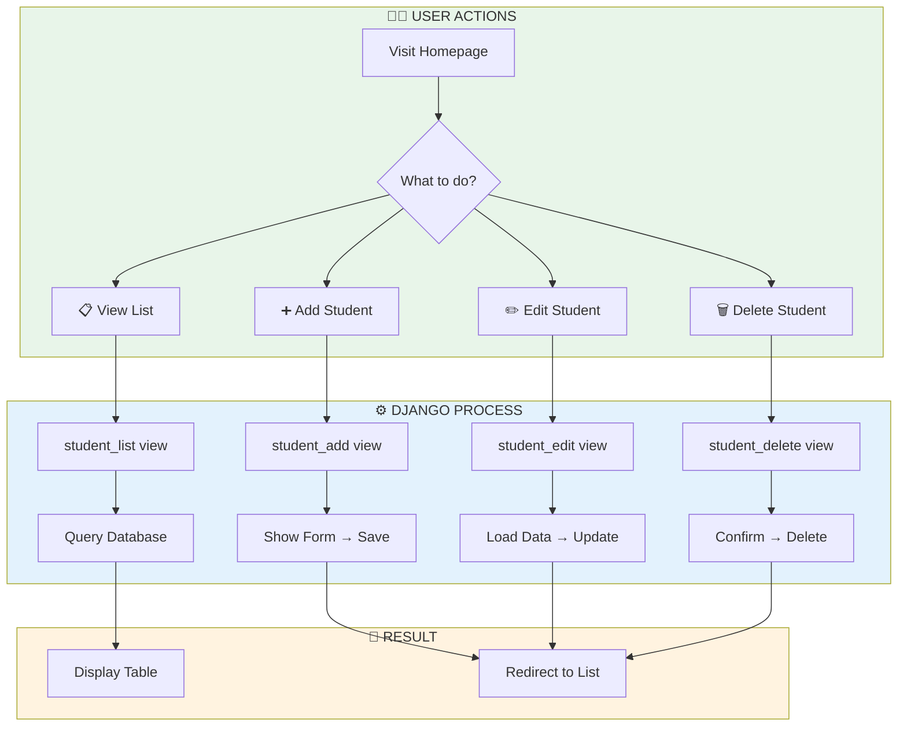
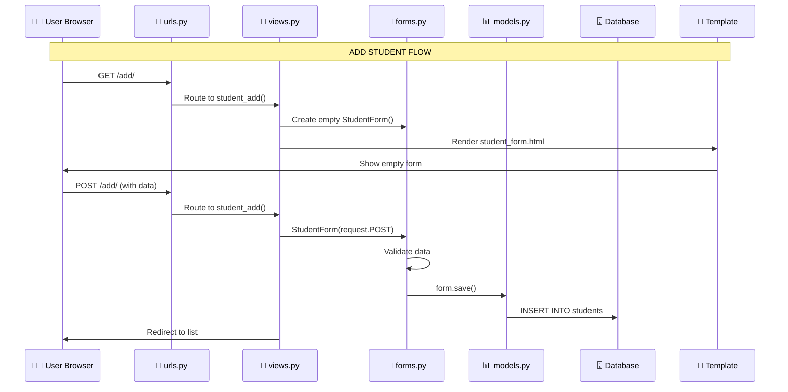
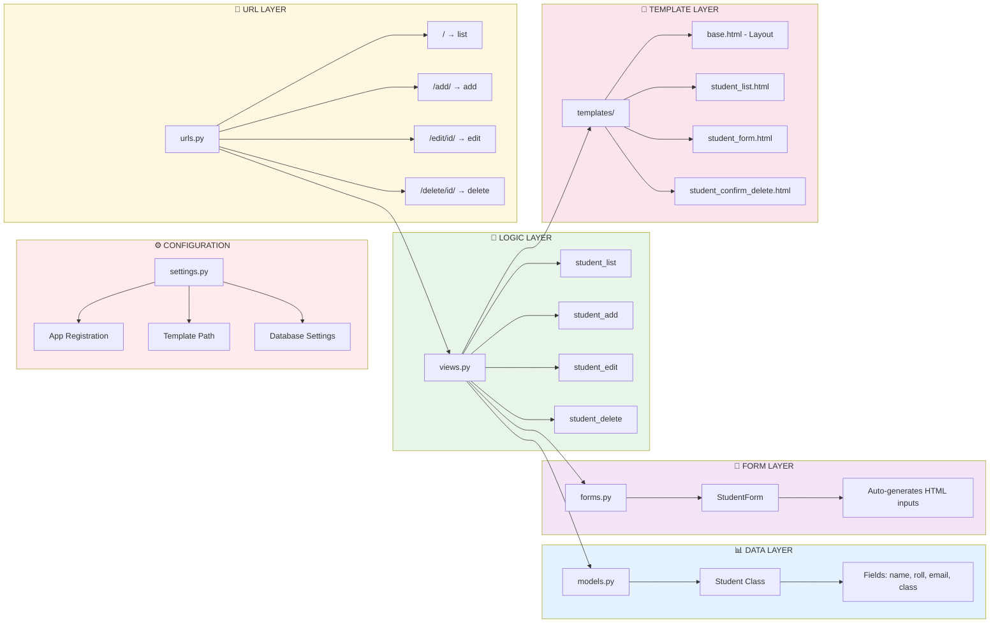
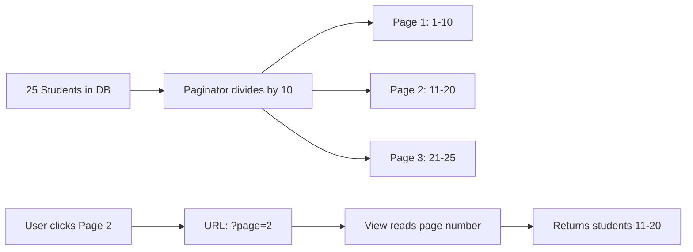

# 🎓 Student CRUD Project - Complete Guide
## How Everything Works + Setup Steps + Flow Diagrams

---

# 📊 MERMAID DIAGRAMS

## 1️⃣ Overall CRUD Operations Flow



---

## 2️⃣ Request-Response Flow (Step by Step)



---

## 3️⃣ File Responsibilities Map



---

## 4️⃣ Each CRUD Operation Explained

```mermaid
flowchart TD
    subgraph LIST["📋 LIST (Read All)"]
        L1[URL: /] --> L2[views.student_list]
        L2 --> L3[Student.objects.all]
        L3 --> L4[Paginator splits into pages]
        L4 --> L5[Render student_list.html]
    end
    
    subgraph ADD["➕ ADD (Create)"]
        A1[URL: /add/] --> A2[views.student_add]
        A2 --> A3{POST or GET?}
        A3 -->|GET| A4[Show empty form]
        A3 -->|POST| A5[Validate & Save]
        A5 --> A6[Redirect to list]
    end
    
    subgraph EDIT["✏️ EDIT (Update)"]
        E1[URL: /edit/1/] --> E2[views.student_edit]
        E2 --> E3[Get student by ID]
        E3 --> E4{POST or GET?}
        E4 -->|GET| E5[Show form with data]
        E4 -->|POST| E6[Update & Save]
        E6 --> E7[Redirect to list]
    end
    
    subgraph DELETE["🗑️ DELETE"]
        D1[URL: /delete/1/] --> D2[views.student_delete]
        D2 --> D3[Get student by ID]
        D3 --> D4{POST or GET?}
        D4 -->|GET| D5[Show confirmation]
        D4 -->|POST| D6[Delete from DB]
        D6 --> D7[Redirect to list]
    end
```



---

## 5️⃣ Pagination Flow



---

# 📁 FILE-BY-FILE EXPLANATION

## 🗂️ Project Structure

```
student_crud/
│
├── studentapp/              # Project Configuration
│   ├── settings.py          # ⚙️ Main settings
│   ├── urls.py              # 🔗 Main URL router
│   └── wsgi.py              # 🚀 Production server
│
├── students/                # Our App
│   ├── models.py            # 📊 Database structure
│   ├── views.py             # 🎯 Business logic
│   ├── forms.py             # 📝 Form handling
│   ├── urls.py              # 🔗 App URL patterns
│   ├── admin.py             # 👑 Admin configuration
│   └── migrations/          # 📋 Database changes
│
├── templates/students/      # HTML Templates
│   ├── base.html            # 🎨 Base layout + CSS
│   ├── student_list.html    # 📋 List + Pagination
│   ├── student_form.html    # ➕✏️ Add/Edit form
│   └── student_confirm_delete.html  # 🗑️ Delete confirm
│
├── db.sqlite3               # 🗄️ SQLite Database
└── manage.py                # 🔧 Django CLI tool
```

---

## 📄 What Each File Does

### 1. `settings.py` - Project Configuration
```
Purpose: Central configuration for entire project
- Registers 'students' app in INSTALLED_APPS
- Sets templates folder path
- Configures database (SQLite)
```

### 2. `models.py` - Data Structure
```
Purpose: Defines Student table structure
- name (CharField) - Student's name
- roll_number (CharField, unique) - Roll number
- email (EmailField) - Email address
- student_class (CharField with choices) - Class 6-10
- created_at (DateTimeField) - Auto timestamp
- updated_at (DateTimeField) - Auto update timestamp
```

### 3. `forms.py` - Form Generation
```
Purpose: Auto-generates HTML form from Model
- Uses ModelForm to create form fields
- Adds CSS classes for styling
- Handles validation automatically
```

### 4. `views.py` - Business Logic
```
Purpose: Handles all CRUD operations
- student_list() → Display all students with pagination
- student_add() → Handle new student creation
- student_edit() → Handle existing student update
- student_delete() → Handle student deletion
```

### 5. `urls.py` (App) - URL Routing
```
Purpose: Maps URLs to view functions
- '' → student_list
- 'add/' → student_add
- 'edit/<int:pk>/' → student_edit
- 'delete/<int:pk>/' → student_delete
```

### 6. Templates - HTML Display
```
base.html → Common layout, CSS styles, messages
student_list.html → Table display, pagination links
student_form.html → Form for add/edit (same template)
student_confirm_delete.html → Deletion confirmation page
```

---

# 🚀 SETUP STEPS (From Scratch)

## Step 1: Create Project Environment
```bash
# Create project folder
mkdir student_crud
cd student_crud

# Create virtual environment
python -m venv venv

# Activate (Windows)
venv\Scripts\activate

# Install Django
pip install django
```

## Step 2: Create Django Project & App
```bash
# Create project (. means current folder)
django-admin startproject studentapp .

# Create app
python manage.py startapp students
```

## Step 3: Configure Settings
Edit `studentapp/settings.py`:
```python
# Add to INSTALLED_APPS:
'students',

# Update TEMPLATES DIRS:
'DIRS': [BASE_DIR / 'templates'],
```

## Step 4: Create Model
Edit `students/models.py` - define Student class

## Step 5: Create Form
Create `students/forms.py` - define StudentForm

## Step 6: Create Views
Edit `students/views.py` - add CRUD functions

## Step 7: Create URLs
Create `students/urls.py` - define URL patterns
Update `studentapp/urls.py` - include app URLs

## Step 8: Create Templates
Create folder: `templates/students/`
Add: base.html, student_list.html, student_form.html, student_confirm_delete.html

## Step 9: Run Migrations
```bash
python manage.py makemigrations
python manage.py migrate
```

## Step 10: Create Superuser (Optional)
```bash
python manage.py createsuperuser
```

## Step 11: Run Server
```bash
python manage.py runserver
```

## Step 12: Test
- Visit: http://127.0.0.1:8000/
- Admin: http://127.0.0.1:8000/admin/

---

# 🎯 KEY CONCEPTS QUICK REFERENCE

| Concept | Code | What It Does |
|---------|------|--------------|
| Get all records | `Student.objects.all()` | Fetch all students |
| Get one record | `get_object_or_404(Student, pk=1)` | Get by ID or 404 |
| Create record | `form.save()` | Save new student |
| Update record | `form.save()` with instance | Update existing |
| Delete record | `student.delete()` | Remove from DB |
| Pagination | `Paginator(queryset, 10)` | 10 items per page |
| Flash message | `messages.success(request, 'Done!')` | Show success msg |
| Redirect | `redirect('student_list')` | Go to another URL |

---

# ✅ TESTING CHECKLIST

- [ ] Can view empty list page
- [ ] Can add new student
- [ ] Success message shows after add
- [ ] Can see student in list
- [ ] Can edit student
- [ ] Changes appear after edit
- [ ] Can delete student
- [ ] Confirmation page shows
- [ ] Student removed after delete
- [ ] Pagination appears when >10 students

---

**🎉 Project Ready for Teaching!**
